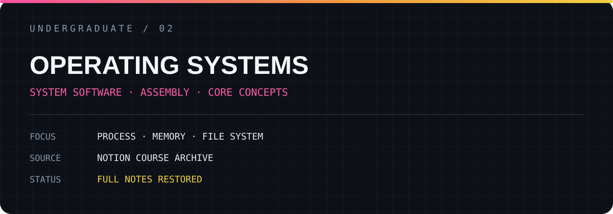

# OPERATING SYSTEMS

Notion에 축적한 수업 필기와 실습 기록을 내용 중심으로 복원한 저장소입니다.

## Archive

- [전체 필기와 실습 내용 보기](./FULL_NOTES.md)
- 총 **13개 페이지**의 수업 기록 수록
- 개인 식별 정보만 제거하고 설명·문제·풀이·코드는 유지

## Scope

`PROCESS` · `MEMORY` · `FILE SYSTEM`

> 원본 강의 첨부파일 자체가 아니라, 개인이 작성한 필기와 학습 기록을 공개합니다.

